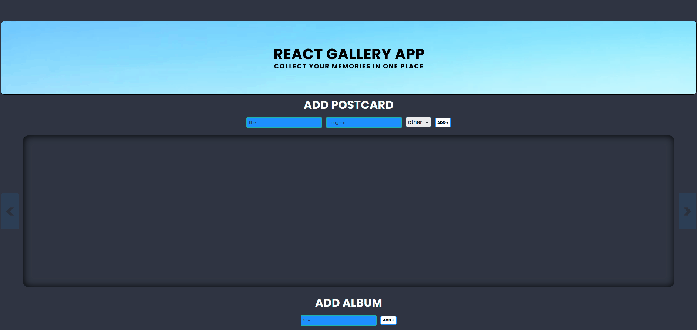

# REACT GALLERY APP

REACT GALLERY is SPA (single-page application) to adding photos as postards and collecting for albums. It allows to add title of postcard, date, URL adress to source of image. It allows to chose album, to which postcard will added. Every postcard has 'remove' method. Every created album has 'remove' and 'open album' methods. I created this aplication to train my skills in REACT and to create something usefull. This project was prepared with React.js library. Project is divided into components with scss styling files and JS files.

## How it works

## Link
https://webster2020-react-gallery.herokuapp.com/

## How to start:

1. git clone git@github.com:Webster2020/REACT_GALLERY.git
2. npm install
3. npm start - run the project and than You can see it on Your device

*...or use link if You only want to check how it works

### Used technologies:
 1. React.js library
 2. SCSS for styling
 3. HTML5 for content
 4. Eslint to control bugs
 5. Husky to control bugs before every commit
 6. Lint Staged to check only changed files

Implemented solutions

 1. Content and  styles are divided into components.
 2. REACT GALLERY functionalities:
  - ADD POSTCARD:
  - creating new card with inputed title, URL to image, current data, and album
  - remove card from cards and from album with clicking on 'remove' button
  - ADD ALBUM:
  - creating new album with inputed name of it
  - remove album and every cards in this album from album with clicking on 'remove' button
  - SHOW MODAL PICTURE:
  - opening modal image with clicking on card (photo in bigger size)
  - SHOW MODAL ALBUM:
  - opening modal album with clicking on 'open modal' button (display all photos from album as gallery)
  - MOVE CARDS or ALBUMS:
  - move cards / albums to the left or to the right with clicking on 'arrow' button 
  - MOVE CARDS IN ALBUM:
  - move cards up or down with clicking on 'arrow' button 

### Project architecture

Project is not diveded on component in accordance with the React convention.
 1. components with JS, JSX and SCSS
 2. root file: index.html
 3. configuration files: gitignore, package.json etc.

### How did I create this project?

Project was prepared based on my own idea and using my current knowledge and skills.

## Plan for future development

 - Refactor code - switch some class components to functional components (with hooks)
 - Ensure each card and each ablum has unique name (block the possibility of repetitions)

## Authors

* **Michal Szwajgier** - *Webster2020* - 

## License
Free licence
